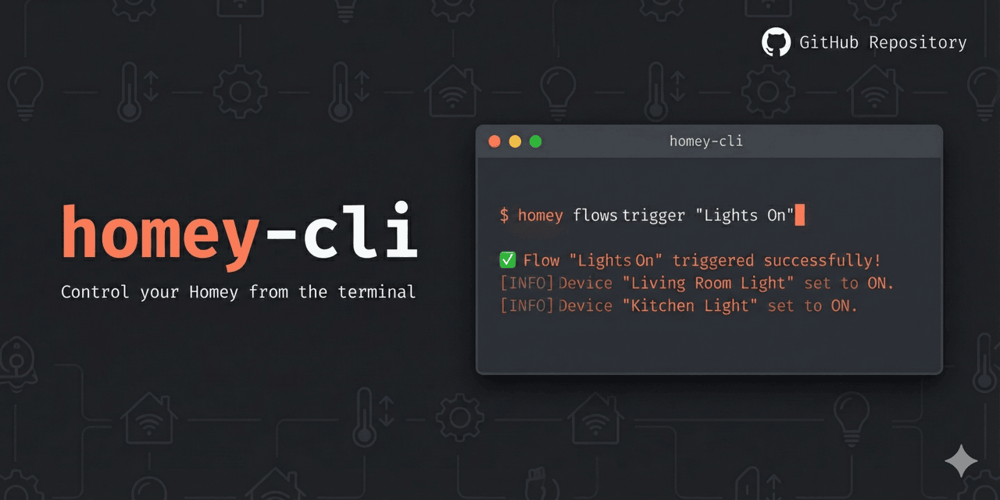

# homeyctl



A command-line interface for controlling [Homey](https://homey.app) smart home devices via local and cloud API.

> **Note:** The binary is named `homeyctl` to avoid conflicts with Athom's official `homey` CLI tool used for app development.

## Installation

### Install script (macOS)

```bash
curl -fsSL https://raw.githubusercontent.com/fishfisher/homeyctl/main/install.sh | sh
```

Fetches the latest release, verifies it against the release checksums, and installs
to `~/.local/bin`. Override with `HOMEYCTL_VERSION=v1.4.0` or
`HOMEYCTL_BIN_DIR=~/bin`. The install stops if the checksum cannot be verified;
`HOMEYCTL_SKIP_CHECKSUM=1` overrides that for a release that genuinely lacks
`checksums.txt`.

If `~/.local/bin` is not on your `PATH`, the script says so; add it to your shell
profile. It installs outside Homebrew's prefix on purpose, so `brew` never manages
or removes the binary.

### Upgrading

```bash
homeyctl upgrade                   # Latest release, verified, replaced atomically
homeyctl upgrade --check           # Report only; exits 1 when behind
homeyctl upgrade --tag v1.4.0      # A specific release
homeyctl install-skill --force     # Then refresh the bundled AI skill
```

homeyctl also checks for a newer release at most once a day, in the background,
and prints one line to stderr when you are behind. It never delays a command and
stays silent offline. Turn it off with `homeyctl config set-update-check off` or
`HOMEYCTL_NO_UPDATE_CHECK=1`. Versions before v1.5.0 have no `upgrade` command;
rerun the install script once to get it.

### Shell completion

Completion covers every command and flag:

```bash
# zsh (add to ~/.zshrc)
source <(homeyctl completion zsh)

# bash, fish, powershell
homeyctl completion bash --help
```

### Uninstalling

```bash
rm ~/.local/bin/homeyctl
rm -rf ~/Library/Application\ Support/homeyctl   # Config, token, and flow backups
```

The second line deletes your flow backups too; keep that directory if you might
need to restore a flow.

### Download a binary

Release assets are public, so no token is required:

```bash
gh release download --repo fishfisher/homeyctl -p 'homeyctl-darwin-arm64'
chmod +x homeyctl-darwin-arm64 && mv homeyctl-darwin-arm64 /usr/local/bin/homeyctl
```

Or grab them from [Releases](https://github.com/fishfisher/homeyctl/releases).

### Build from source

```bash
go install github.com/fishfisher/homeyctl@latest
```

> **Previously installed with Homebrew?** homeyctl is no longer published to
> `fishfisher/homebrew-tap`. Run `brew uninstall homeyctl`, then use the install
> script above. Binaries are ad-hoc signed by the Go toolchain and not notarized.

## Quick Start

```bash
# Login with your Athom account (opens browser)
homeyctl auth login

# List your devices
homeyctl devices list

# Control a device
homeyctl devices on "Living Room Light"

# Get system overview
homeyctl snapshot
```

## Configuration

### Connection Modes

homeyctl supports local (LAN) and cloud connections:

```bash
homeyctl config set-mode auto    # Choose configured local address first (no network failover)
homeyctl config set-mode local   # Always use local
homeyctl config set-mode cloud   # Always use cloud
```

### Auto-Discovery

```bash
homeyctl config discover         # Find Homey on local network (mDNS)
```

### Manual Configuration

```bash
# Local connection
homeyctl config set-local http://192.168.1.50 <token>

# Cloud connection
homeyctl config set-cloud <token> --address https://<homey-id>.connect.athom.com

# View current config
homeyctl config show
```

### Creating API Tokens

```bash
# For AI bots (read-only, safe)
homeyctl auth token create "AI Bot" --preset readonly --no-save

# For automation (can control devices)
homeyctl auth token create "Automation" --preset control --no-save
```

Available presets: `readonly`, `control`, `full`

Configuration is stored in your OS config directory. On macOS this is
`~/Library/Application Support/homeyctl/config.toml`.

Remote mode requires the selected Homey's HTTPS API address and a key accepted by
that Homey. It does not send Homey device-manager requests to the Athom account API.
Use `HOMEY_CLOUD_ADDRESS` and `HOMEY_CLOUD_TOKEN` to configure this via the environment.
Configuration tokens are fully redacted in `config show`, and saved config files
use owner-only permissions.

> **Upgrading from 1.3.x:** cloud mode previously pointed at a placeholder Athom
> account URL and never reached your Homey. It now requires an explicit address,
> so a config with `mode = "cloud"` and no address fails with a clear message
> instead of sending requests nowhere. Fix it once with
> `homeyctl config set-cloud <key> --address https://<homey-id>.connect.athom.com`.
> Local mode is unaffected.

## AI flow builder

The bundled [Homey skill](homey-skill/SKILL.md) covers discovery, Advanced Flow
graphs, Logic variables, review, and recovery across shell-capable agents.

```bash
homeyctl install-skill --path ~/.agents/skills
homeyctl flows validate draft.json --json          # Offline structure and graph checks
homeyctl flows validate draft.json --online --json # Installed cards and Logic references
homeyctl flows create draft.json --ai --dry-run     # Preview; no API calls or writes
homeyctl flows create draft.json --ai --json        # Disabled, in the AI Flows folder
homeyctl flows list --folder "AI Flows" --disabled # Drafts awaiting review
homeyctl flows enable <id>                         # Show what enabling does; no change
homeyctl flows enable <id> --yes                   # Enable after review
homeyctl flows audit --problems                    # Read-only; only flows with findings
homeyctl flows restore backup.json --dry-run       # Preview a restore from a backup
```

`--ai` overrides `enabled` to false and assigns the root-level `AI Flows` folder.
The user can review the draft in Homey, then choose when to enable it and where
to move it. Creating a draft does not authorize executing its physical actions.

`flows enable` is where that authorization happens. Without `--yes` it lists
what the flow triggers on and what it does, with device names resolved and
missing devices marked, and changes nothing. With `--yes` it backs up the flow,
enables it, and reads it back. `flows disable` needs no confirmation and works
even on a flow that fails validation, so a broken flow can always be switched
off.

Every flow update and deletion first saves a full local backup, and aborts if
the backup fails. Update previews show the merged before/after document. Writes
are fetched again to verify the requested state and structure. Backups are under
the OS config directory's `homeyctl/backups` and use owner-only file permissions.

`homeyctl flows restore <backup-file>` applies a backup back onto its own flow as
a complete document, so anything added since is removed. It backs up the current
state first and reads the result back before reporting success. A deleted flow
cannot be restored in place; its id is gone, so recreate it with `flows create`
and repair references from other flows.

```bash
homeyctl flows update <flow-id> patch.json --dry-run
homeyctl flows update <flow-id> patch.json --json
# Restore a complete Advanced Flow graph after reviewing its enabled/folder fields:
homeyctl flows update <flow-id> backup.json --replace-cards --dry-run
```

Advanced card entries replace whole card objects. Omitted cards are preserved;
explicit null card entries remove them. `--replace-cards` also removes omitted
cards and is intended for deliberate graph replacement or restoration. Flow
deletion requires `--force`. Recreating a deleted flow gives it a new ID.

Variable batches are planned before application:

```bash
homeyctl variables batch variables.json --prefix AI.Heating. --json
```

The manifest is an array of `{name,type,value,purpose}` entries. Matching names
and types are reused without overwriting their values. Add `--apply` only after
review. Ten or more new variables require per-variable purposes, explicit user
approval, `--confirm-count`, and the plan's `--approve` hash. Thirty or more also
require a namespace via `--prefix`. Partial applications leave a receipt for
inspection and re-planning. These guards complement agent instructions; the CLI
cannot independently establish that a human approved the operation.

See the [audit report](docs/audit-2026-09.md) for scope, evidence, and limitations.

---

## Command Reference

### Devices

The most commonly used commands for controlling your smart home.

```bash
# List and search
homeyctl devices list                        # List all devices
homeyctl devices list --match "kitchen"      # Filter by name
homeyctl devices list --zone "Hovedetasje"   # A zone and every zone beneath it
homeyctl devices get "Device Name"           # Get device details
homeyctl devices values "Device Name"        # Get all capability values

# Control
homeyctl devices on "Living Room Light"      # Turn on
homeyctl devices off "Living Room Light"     # Turn off
homeyctl devices set "Light" dim 0.5         # Set capability value
homeyctl devices set "Thermostat" target_temperature 22

# Management
homeyctl devices rename "Old Name" "New Name"
homeyctl devices move "Device" "New Zone"
homeyctl devices delete "Device"
homeyctl devices hide "Device"               # Hide from UI
homeyctl devices unhide "Device"             # Show in UI

# Customization
homeyctl devices set-icon "Device" icon.png  # Custom icon
homeyctl devices set-note "Device" "Note"    # Add a note

# Settings (separate from capabilities)
homeyctl devices get-settings "Motion Sensor"
homeyctl devices set-setting "Motion Sensor" motion_sensitivity high
```

### Zones

Organize your home into zones.

```bash
homeyctl zones list                          # List all zones
homeyctl zones get "Living Room"             # Get zone details
homeyctl zones create "New Zone"             # Create zone
homeyctl zones create "Bedroom" --parent "Upstairs"  # Nested zone
homeyctl zones rename "Old" "New"            # Rename
homeyctl zones move "Zone" "New Parent"      # Move to different parent
homeyctl zones delete "Zone"                 # Delete

# Icons
homeyctl zones icons                         # List available icons
homeyctl zones set-icon "Zone" "bedroom"     # Set zone icon
```

### Flows

Automate your home with flows.

```bash
# List and view
homeyctl flows list                          # List all flows
homeyctl flows list --match "morning"        # Filter by name
homeyctl flows list --folder "Soverom"       # Only flows directly in a folder
homeyctl flows list --disabled               # Or --enabled
homeyctl flows get "Flow Name"               # Get flow details
homeyctl flows audit --problems              # Validate; show only flows with findings

# Control
homeyctl flows trigger "Good Morning"        # Trigger manually
homeyctl flows enable "Good Morning"         # Show what it would do; no change
homeyctl flows enable "Good Morning" --yes   # Back up, then enable
homeyctl flows disable "Good Morning"        # Back up, then disable

# Create and modify
homeyctl flows create flow.json              # Create from JSON
homeyctl flows create --advanced flow.json   # Create advanced flow
homeyctl flows update "Flow" changes.json    # Update (merge)
homeyctl flows delete "Flow" --force         # Back up, then delete

# Flow cards (for creating flows)
homeyctl flows cards --type trigger          # List triggers
homeyctl flows cards --type condition        # List conditions
homeyctl flows cards --type action           # List actions
```

#### Flow Folders

Organize flows into folders.

```bash
homeyctl flows folders list                  # List folders
homeyctl flows folders get "Folder"          # Get folder details
homeyctl flows folders create "New Folder"   # Create
homeyctl flows folders update "Folder" --name "New Name"
homeyctl flows folders delete "Folder"       # Delete
```

### Presence

Track and control user presence (home/away) and sleep status.

```bash
# Check presence
homeyctl presence get me                     # Your status
homeyctl presence get "User Name"            # Other user

# Set presence
homeyctl presence set me home                # Mark as home
homeyctl presence set me away                # Mark as away
homeyctl presence set "User" home

# Sleep status
homeyctl presence asleep get me
homeyctl presence asleep set me asleep       # Mark as sleeping
homeyctl presence asleep set me awake        # Mark as awake
```

### Moods

Control room moods and ambiances.

```bash
homeyctl moods list                          # List all moods
homeyctl moods get "Relaxed"                 # Get mood details
homeyctl moods set "Movie Night"             # Activate a mood
homeyctl moods create "New Mood" mood.json   # Create
homeyctl moods update "Mood" changes.json    # Update
homeyctl moods delete "Mood"                 # Delete
```

### Weather

Get weather information from Homey.

```bash
homeyctl weather current                     # Current conditions
homeyctl weather forecast                    # Hourly forecast
```

### Energy

Monitor energy consumption and electricity prices.

```bash
# Live usage
homeyctl energy live                         # Current power consumption

# Reports
homeyctl energy report day                   # Today
homeyctl energy report day --date 2025-01-10
homeyctl energy report week                  # This week
homeyctl energy report month --date 2025-01  # January
homeyctl energy report year                  # This year
homeyctl energy report year 2024             # Specific year

# Electricity prices
homeyctl energy price                        # Show prices
homeyctl energy price set 0.50               # Set fixed price
homeyctl energy price type                   # Show price type
homeyctl energy price type fixed             # Use fixed pricing
homeyctl energy price type dynamic           # Use dynamic pricing

# Management
homeyctl energy currency                     # Show currency
homeyctl energy delete --force               # Delete all reports
```

### Apps

Manage installed Homey apps.

```bash
# List and view
homeyctl apps list                           # List all apps
homeyctl apps get "App Name"                 # Get app details
homeyctl apps usage "App Name"               # Resource usage

# Control
homeyctl apps restart com.app.id             # Restart app
homeyctl apps enable com.app.id              # Enable
homeyctl apps disable com.app.id             # Disable

# Install/Uninstall
homeyctl apps install com.app.id             # Install from store
homeyctl apps install com.app.id --channel test  # Test channel
homeyctl apps uninstall com.app.id           # Uninstall

# Settings
homeyctl apps settings list "App"            # List settings
homeyctl apps settings set "App" key value   # Set setting
```

### Users

Manage Homey users.

```bash
homeyctl users list                          # List all users
homeyctl users get "User Name"               # Get user details
homeyctl users me                            # Get current user
homeyctl users create --role guest           # Create guest invite
homeyctl users delete "User"                 # Delete user
```

### Dashboards

Manage Homey dashboards.

```bash
homeyctl dashboards list                     # List dashboards
homeyctl dashboards get "Dashboard"          # Get details
homeyctl dashboards create "New Dashboard"   # Create
homeyctl dashboards update "Dashboard" changes.json
homeyctl dashboards delete "Dashboard"       # Delete
```

### Notifications

Send and manage timeline notifications.

```bash
homeyctl notify send "Hello from CLI"        # Send notification
homeyctl notify list                         # List notifications
homeyctl notify delete <id>                  # Delete one
homeyctl notify clear                        # Clear all
homeyctl notify owners                       # List sources
```

### Insights

Access historical data and logs.

```bash
# List and view
homeyctl insights list                       # List all logs
homeyctl insights get "log-id"               # Get data (last 24h)
homeyctl insights get "log-id" --resolution lastWeek
homeyctl insights get "log-id" --resolution lastMonth

# Management
homeyctl insights delete "log-id"            # Delete log
homeyctl insights clear "log-id"             # Clear entries only
```

Resolutions: `last24Hours`, `lastWeek`, `lastMonth`, `lastYear`, `last2Years`

### Variables

Manage logic variables for flows.

```bash
homeyctl variables list                      # List all
homeyctl variables get "my_var"              # Get value
homeyctl variables set "my_var" 42           # Set value
homeyctl variables create "new_var" number 0 # Create
homeyctl variables delete "my_var" --force   # Back up, then delete
```

### System

System information and control.

```bash
homeyctl system info                         # System information
homeyctl system name get                     # Get Homey name
homeyctl system name set "My Homey"          # Set Homey name
homeyctl system users                        # List system users
homeyctl system reboot --force               # Reboot Homey
```

### Snapshot

Get a quick overview of your system.

```bash
homeyctl snapshot                            # System, zones, devices
homeyctl snapshot --include-flows            # Include flows
```

---

## Output Formats

```bash
# Human-readable output (default)
homeyctl devices list

# JSON output (for scripting)
homeyctl devices list --json
```

### Parsing JSON with jq

```bash
# Find devices by name
homeyctl devices list --json | jq '.[] | select(.name | test("light";"i"))'

# Names of broken flows
homeyctl flows list --json | jq -r '.[] | select(.broken) | .name'

# Device IDs on a floor, including its rooms
homeyctl devices list --zone "Hovedetasje" --json | jq -r '.[].id'
```

---

## Creating Flows

Create flows from JSON files. The CLI validates your JSON and warns about common mistakes.

### Simple Flow Example

```json
{
  "name": "Heat office on arrival",
  "trigger": {
    "id": "homey:manager:presence:user_enter",
    "args": { "user": {"id": "<user-id>", "name": "User"} }
  },
  "conditions": [
    {
      "id": "homey:manager:logic:lt",
      "droptoken": "homey:device:<device-id>|measure_temperature",
      "args": {"comparator": 20}
    }
  ],
  "actions": [
    {"id": "homey:device:<device-id>:on", "args": {}},
    {"id": "homey:device:<device-id>:target_temperature_set", "args": {"target_temperature": 23}}
  ]
}
```

### Important: Droptoken Format

When referencing device capabilities in conditions, use pipe (`|`) as separator:

```
CORRECT: "homey:device:abc123|measure_temperature"
WRONG:   "homey:device:abc123:measure_temperature"
```

### Flow Update Behavior

`homeyctl flows update` does a **partial/merge update**:
- Only fields you include will be changed
- Omitted fields keep their existing values
- To remove conditions/actions, explicitly set empty array: `"conditions": []`

---

## AI Assistant Support

Install the embedded AI skill to your AI tool's skill directory:

```bash
homeyctl install-skill
```

This installs skill files that AI assistants (Claude Code, Codex, etc.) can discover and use for smart home control.

---

## Environment Variables

All config options can be set via environment variables (prefix `HOMEY_`):

```bash
export HOMEY_MODE=auto              # auto, local, or cloud
export HOMEY_LOCAL_ADDRESS=http://192.168.1.50
export HOMEY_LOCAL_TOKEN=your-local-token
export HOMEY_CLOUD_TOKEN=your-cloud-token
export HOMEY_CLOUD_ADDRESS=https://your-homey-id.connect.athom.com
```
